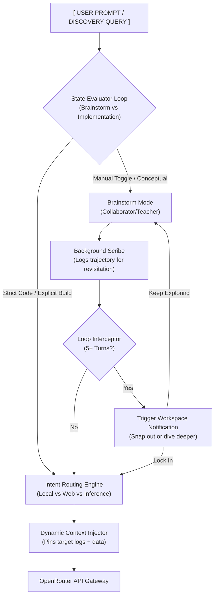

```mermaid
graph TD
    Prompt["[ USER PROMPT / DISCOVERY QUERY ]"]
    StateCheck{"State Evaluator Loop<br>(Brainstorm vs Implementation)"}
    
    %% Brainstorm Track
    B_Mode["Brainstorm Mode<br>(Collaborator/Teacher)"]
    Scribe["Background Scribe<br>(Logs trajectory for revisitation)"]
    Interceptor{"Loop Interceptor<br>(5+ Turns?)"}
    Notify["Trigger Workspace Notification<br>(Snap out or dive deeper)"]
    
    %% Core Engine
    Engine["Intent Routing Engine<br>(Local vs Web vs Inference)"]
    Injector["Dynamic Context Injector<br>(Pins target logs + data)"]
    Gateway["OpenRouter API Gateway"]
    
    Prompt --> StateCheck
    
    %% Routing the tracks
    StateCheck -- "Manual Toggle / Conceptual" --> B_Mode
    StateCheck -- "Strict Code / Explicit Build" --> Engine
    
    B_Mode --> Scribe
    Scribe --> Interceptor
    Interceptor -- "Yes" --> Notify
    Interceptor -- "No" --> Engine
    Notify -- "Lock In" --> Engine
    Notify -- "Keep Exploring" --> B_Mode
    
    Engine --> Injector
    Injector --> Gateway
```