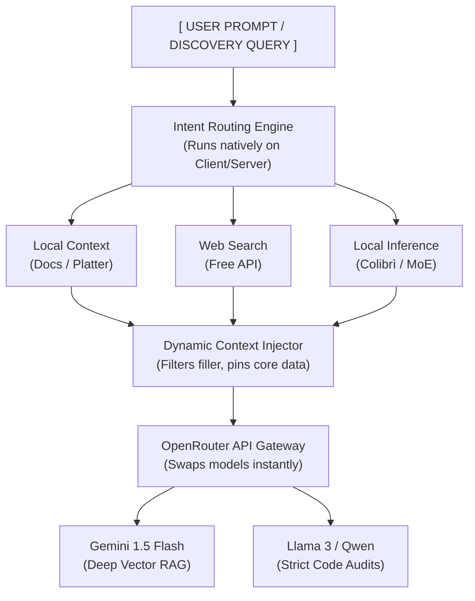

# Application Architecture

```mermaid
graph TD
    Prompt["[ USER PROMPT / DISCOVERY QUERY ]"]
    Engine["Intent Routing Engine<br>(Runs natively on Client/Server)"]
    LocalC["Local Context<br>(Docs / Platter)"]
    WebS["Web Search<br>(Free API)"]
    LocalI["Local Inference<br>(Colibrì / MoE)"]
    Injector["Dynamic Context Injector<br>(Filters filler, pins core data)"]
    Gateway["OpenRouter API Gateway<br>(Swaps models instantly)"]
    Gemini["Gemini 1.5 Flash<br>(Deep Vector RAG)"]
    Llama["Llama 3 / Qwen<br>(Strict Code Audits)"]

    Prompt --> Engine
    Engine --> LocalC
    Engine --> WebS
    Engine --> LocalI
    LocalC --> Injector
    WebS --> Injector
    LocalI --> Injector
    Injector --> Gateway
    Gateway --> Gemini
    Gateway --> Llama
```
